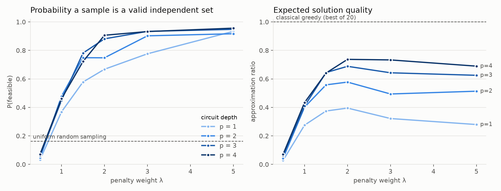

# QAOA for Maximum Independent Set: how hard should the penalty push?

[](https://github.com/Deon-JBW/qaoa-mis/actions/workflows/ci.yml)

Most problems worth solving on a quantum computer come with constraints, and the
Quantum Approximate Optimization Algorithm (QAOA) doesn't handle constraints
natively. The standard workaround is to fold them into the cost as a penalty. I
wanted to see what that choice actually costs, so I built QAOA for Maximum
Independent Set in Qiskit and swept the penalty weight against circuit depth.



*Mean over 10 random 8-vertex graphs. Left: how often a measurement is a valid
independent set. Right: expected set size relative to the true maximum, where
invalid samples score 0.*

## The problem

Pick as many vertices as possible so that no two share an edge. With xᵢ = 1
meaning vertex i is chosen, QAOA minimizes

```
C(x) = −Σᵢ xᵢ  +  λ · Σ₍ᵢ,ⱼ₎∈E xᵢxⱼ
```

The first term rewards big sets; the second charges λ for every violated edge.
For λ > 1 the minimizers of C are exactly the maximum independent sets (dropping
one endpoint of a violated edge changes the cost by 1 − λ < 0). At λ ≤ 1 an
invalid set can tie with or beat the real answer. Both facts are checked
exhaustively in `tests/test_problem.py`.

## What I found

**1. Below λ = 1, QAOA does its job and still gives you garbage.** At λ = 0.5
only 3–7% of samples are valid, which is *worse than guessing uniformly* (16%).
Nothing is broken: the cost rewards invalid sets, and the optimizer finds them.
The theory said λ must exceed 1. The sweep shows what ignoring that looks like.

**2. Feasibility and quality pull in opposite directions.** Raising λ makes
valid samples more likely (at depth 1: 58% at λ = 1.5, 93% at λ = 5), but the
quality of those samples drops. At λ = 5 and depth 1 the circuit learns to play
it safe: 93% of samples are valid, yet the approximation ratio is only 0.28 and
the optimum shows up 0.5% of the time. A large penalty drowns out the part of
the cost that says "pick more vertices".

**3. There's a sweet spot, and depth moves it.** Quality peaks around λ = 2 at
every depth. It was the best penalty on 6 of the 10 graphs at depth 4, and λ = 3
or 5 on the rest. Extra depth helps most where the penalty is large: at λ = 5 the
ratio climbs from 0.28 (p = 1) to 0.69 (p = 4). At λ = 2 it goes from 0.40 to
0.74.

**4. Lower energy doesn't always mean better answers.** The optimizer minimizes
⟨C⟩, and with the warm start described below that energy never gets worse as
depth grows. But the fraction of valid samples still dropped with added depth in
66 of 180 (graph, λ, depth) steps. The objective you optimize isn't the metric
you care about, and at small depth the gap is visible.

**5. A classical greedy heuristic beats all of this.** On 8-vertex graphs,
networkx's randomized maximal independent set (best of 20 tries) found the true
optimum on every graph. I'm not claiming a quantum advantage. The point of this
project is to understand how the constraint encoding shapes QAOA's behaviour, at
a size where I can check every answer exactly.

## How it's built

```
qaoa_mis/problem.py     MIS cost, feasibility, brute force, Ising mapping
qaoa_mis/circuit.py     Qiskit QAOA circuit + a fast NumPy simulator
qaoa_mis/optimize.py    COBYLA with random restarts and a warm start per depth
qaoa_mis/experiment.py  the penalty × depth sweep -> results/sweep.csv
qaoa_mis/plots.py       figures/penalty_sweep.png
tests/                  49 tests
```

**Qiskit is the reference; NumPy is the fast path.** The sweep runs about
240 optimizations with hundreds of objective calls each, so it uses a
statevector simulator that applies the cost layer as a diagonal phase and the
mixer as an RX on every qubit. Tests check it against Qiskit's `Statevector` to
1e-10 at depths 1–3. A separate test turns the mixer off and confirms the Qiskit
circuit applies exactly exp(−iγC) to every bitstring, up to global phase. That
one check pins down the Ising derivation, the factor of 2 in `RZ`/`RZZ`, and
qubit ordering (Qiskit is little-endian, so vertex i is bit i of the index).

**A bug my own analysis caught.** The first full sweep had depth p score worse
than depth p − 1 in 6 of 180 cases, even though a warm start from the shallower
solution was supposed to rule that out. Two things were wrong:

- I extended the previous angles by repeating the last layer. That's a
  different circuit, not the old one. Only a layer with γ = β = 0 (the identity)
  reproduces the depth p − 1 state exactly.
- COBYLA can finish somewhere worse than where it started.

The optimizer now tries the zero-layer start, keeps each starting point as a
candidate, and a regression test checks the guarantee across 12 graph/penalty
combinations. My original test had passed only because its one graph didn't
trigger the problem, which is also why the regression test now covers many.

## Run it

```bash
python -m venv venv
venv\Scripts\activate            # macOS/Linux: source venv/bin/activate
pip install -r requirements-dev.txt

pytest -v                         # ~45 s
python -m qaoa_mis.experiment     # full sweep, ~35 min on my laptop
python -m qaoa_mis.plots          # regenerate the figure
```

`python -m qaoa_mis.experiment --quick` runs a tiny version in seconds; CI runs
it on every push along with `ruff` and the tests, on Python 3.11–3.13. Results
are deterministic: graphs and optimizer starts are seeded.

## Limitations

- 8 vertices, 10 graphs, one random-graph family (G(n, 0.4), connected). The
  trends are clear at this size. Whether they hold at scale is an open question.
- Noiseless statevector simulation. Real hardware adds noise and shot sampling.
- The penalty is the simplest constraint encoding. It's what I wanted to study
  first, but it isn't the only one.

## What I'd try next

- **Constraint-preserving mixers**, which keep the state inside the valid
  subspace so no penalty is needed. The obvious comparison to this sweep.
- **Objectives closer to the goal**, such as optimizing only the best fraction
  of samples (CVaR) instead of the mean, given finding 4.
- **Noise**, with Qiskit Aer noise models, to see whether the λ sweet spot moves.
- **Bigger graphs** with a sampling-based simulator, to test whether finding 3
  holds up.
